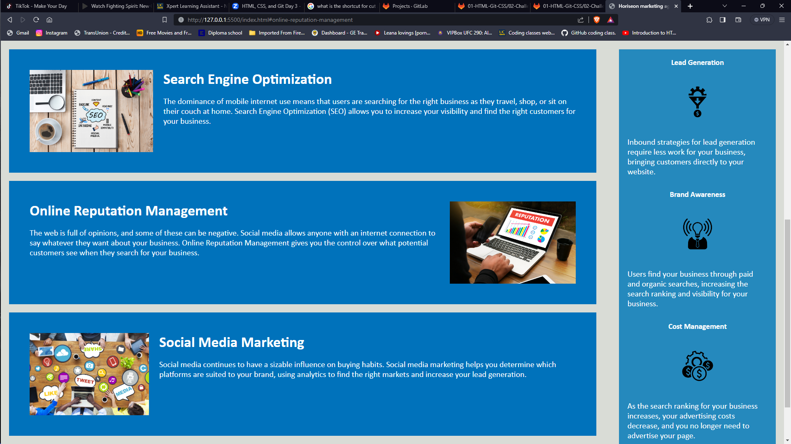
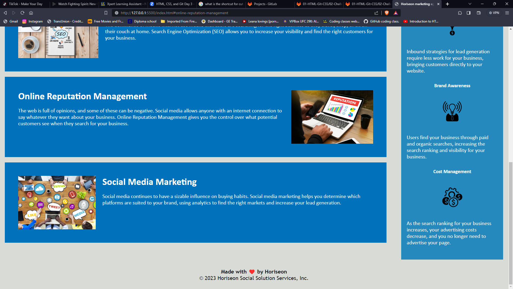

# Horiseon marketing updates

## Homework assignment
updated and corrected accesability of Horiseon marketing and put all code in simantic order. I also corrected all improperly working links and updated general text size slightly for better readability.
Created a README.md and added build link and website screenshots.

## Table of Contents
- [Installation](#installation)
- [Usage](#usage)
- [License](#license)
- [Contributing](#contributing)
- [Tests](#tests)
- [Questions](#questions)

## Installation
N/A

## Usage
N/A

## License
N/A

## Contributing
N/A

## Tests
N/A

## Questions
If you have any questions, please contact me at [email@example.com](mailto:email@example.com). You can also visit my GitHub profile at [github.com/username](https://github.com/username).

## Badges
[

## Screenshots

## Deployed Application
[Link to Live Application](https://your-app-url.com)